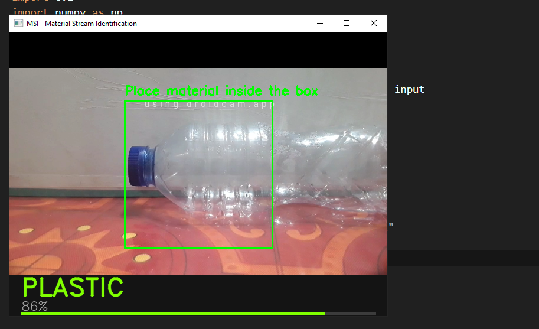
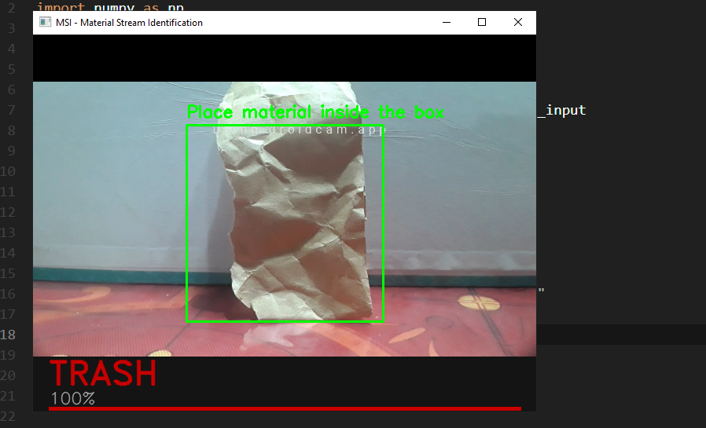

# Material Stream Identification System

Cairo University — Faculty of Computing and Artificial Intelligence
Machine Learning Course — Final Project

| ID | Class     | Description                                       |
|----|-----------|---------------------------------------------------|
| 0  | Cardboard | Multi-layer cellulose fiber material              |
| 1  | Glass     | Bottles, jars, amorphous silicates                |
| 2  | Metal     | Aluminum cans, steel scrap                        |
| 3  | Paper     | Newspapers, office paper                          |
| 4  | Plastic   | Water bottles, film, organic compounds            |
| 5  | Trash     | Non-recyclable / contaminated waste               |
| 6  | Unknown   | Out-of-distribution or blurred inputs (rejection) |

---

## Setup

```bash
pip install -r requirements.txt
```

## Run Order

1. Unzip `dataset.zip` into the project root
2. Run `src/1. data_aug.ipynb`
3. Run `src/2. feature_extraction.ipynb`
4. Run `src/SVM_Model.ipynb` and `src/KNN_Model.ipynb`
5. Run the camera app:

```bash
python src/camera_app.py
```

Press **Q** to quit.

---

## Project Structure
```
Material-Stream-Classifier/
├── demo/
├── models/
├── src/
│   ├── 1. data_aug.ipynb
│   ├── 2. feature_extraction.ipynb
│   ├── KNN_Model.ipynb
│   ├── SVM_Model.ipynb
│   └── camera_app.py
├── dataset.zip
├── .gitignore
├── README.md
└── requirements.txt
```
---
## Data Augmentation
 
The original dataset had significant class imbalance (Trash: 110 images total, Paper: 476 total).
Augmentation was applied to the **training split only**, balancing all training classes to 500 images — a >30% increase overall.
A leakage check is run automatically to ensure no exact duplicates exist across train/val/test splits.
 
| Technique             | Parameters                          | Notes                                         |
|-----------------------|-------------------------------------|-----------------------------------------------|
| Horizontal Flip       | p = 0.5                             | Applied to all classes                        |
| Rotation              | ±12° (±8° for Trash)                | Trash uses gentler range to avoid overfitting |
| Zoom / Scale          | 0.90–1.00× (0.94–1.00× for Trash)  |                                               |
| Brightness & Contrast | Mild adjustment (gentler for Trash) |                                               |
| Gaussian Noise        | Low injection, p = 0.35             | Randomly applied, not guaranteed per image    |
 
> **Note:** The Trash class uses a separate, gentler augmentation profile across all parameters
> due to its high intra-class visual variability and lower original sample count.
 
---
 
## Feature Extraction
 
Each image is converted into a fixed-length 28,292-dimensional vector by combining two descriptors:
 
| Descriptor           | Output Dim | What it captures                                |
|----------------------|------------|-------------------------------------------------|
| HOG                  | 26,244     | Edges, gradients, local structure               |
| CNN (ResNet50 + GAP) | 2,048      | Texture, material appearance, semantic patterns |
| **Combined**         | **28,292** | [HOG_scaled \| CNN_scaled]                      |
 
Both HOG-only and CNN-only feature sets are also saved separately to allow classifier comparison.
 
---
 
## Classifiers
 
### SVM vs KNN Comparison
 
| Feature Set | SVM Val Acc | SVM Test Acc | KNN Val Acc | KNN Test Acc |
|-------------|-------------|--------------|-------------|--------------|
| HOG only    | 0.606       | 0.601        | 0.580       | 0.615        |
| CNN only    | 0.864       | 0.922        | 0.867       | 0.883        |
| HOG + CNN   | 0.835       | 0.908        | 0.885       | 0.887        |
 
**SVM** used CNN only + PCA (90% variance retained), RBF kernel, C=10, gamma=scale. Final test accuracy: **92.2%** (rejection threshold: 0.5, accuracy with rejection: **91.17%**).
 
**KNN** used HOG + CNN combined features, k=7, distance weighting, Euclidean distance. Final test accuracy: **88.7%** (rejection threshold: 0.5, accuracy with rejection: **90.07%**).
 
SVM was selected for deployment because it achieved the highest test accuracy (92.2%) and the highest rejection-adjusted accuracy (91.17%), outperforming KNN's 90.07%. At inference the app uses CNN-only features passed through PCA, and rejects any prediction whose maximum class probability falls below 0.5.
 
### Rejection Mechanism
 
| Model | Method                                  | Threshold | Accuracy with Rejection |
|-------|-----------------------------------------|-----------|-------------------------|
| SVM   | Max class probability < 0.5 → Unknown  | 0.5       | 91.17%                  |
| KNN   | Neighbor vote majority < 0.5 → Unknown | 0.5       | 90.07%                  |
 
---
 
## Camera App
 
The real-time application captures live webcam frames, crops a **250×250 ROI** from the centre, extracts CNN features, applies PCA, and runs the SVM classifier. Inference runs every 10th frame (~3 predictions/second) to keep the feed smooth. If the maximum class probability falls below 0.5, the prediction is rejected and labelled Unknown. The predicted class and confidence are shown as a colour-coded overlay.
 


 
---
 
## Contributors
 
| Name                        | Responsibility          |
|-----------------------------|-------------------------|
| Basmala Mohsen El-Batran    | Data Augmentation       |
| Laila Mohamed Shawky        | Feature Extraction      |
| Martina Waleed Salah        | KNN Classifier          |
| Malak Moustafa Abdel-Maboud | SVM Classifier          |
| Jumanah Muhammad Ali        | Camera App & Repository |
